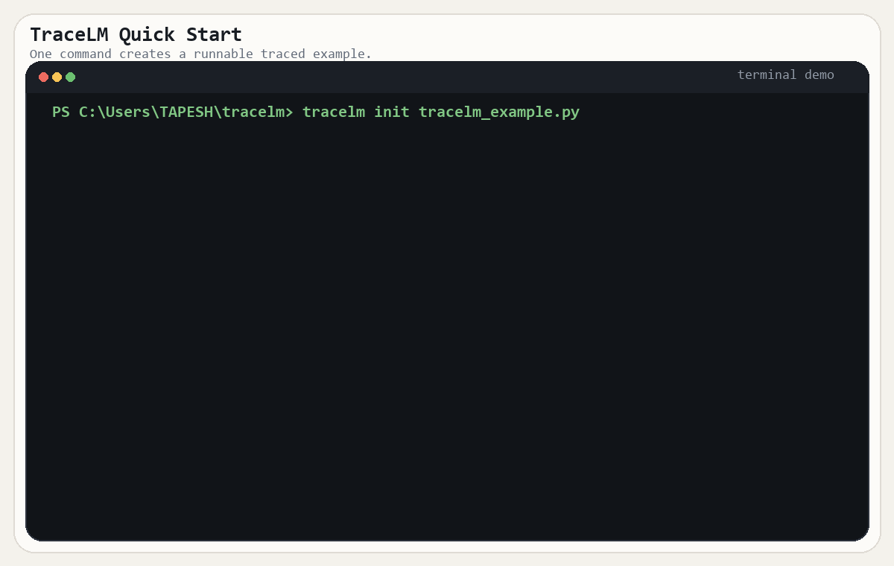

# TraceLM

TraceLM is a lightweight execution tracer and profiler for LLM pipelines, RAG systems, and FastAPI-based AI services.

It focuses on the tracing primitives that matter when you want to understand execution flow clearly: span trees, `traceparent` propagation, sampling, profiling, and local inspection.

## Why TraceLM

TraceLM exists for developers who want observability without pulling in a full telemetry stack on day one.

- Trace multi-step LLM workflows with explicit spans
- Validate trace structure before profiling
- Continue traces across service boundaries with W3C `traceparent`
- Inspect latency, critical path, token usage, and cost from the CLI
- Export traces to Chrome Trace or OpenTelemetry-compatible JSON

It is intentionally small, local-first, and easy to read.

## Installation

```bash
pip install tracelm
```

Try it immediately:

```bash
tracelm demo
tracelm init
```

Optional integrations:

```bash
pip install "tracelm[fastapi]"
pip install "tracelm[requests]"
pip install "tracelm[otel]"
```

## Quick Start



The fastest path is the built-in demo:

```bash
tracelm demo
tracelm latest
tracelm export latest --format chrome
```

That gives you a real trace, a readable summary, and an exportable file without writing any code.

If you want a starter file generated for you:

```bash
tracelm init
tracelm run tracelm_example.py
```

If you want to trace your own script, create a small instrumented file:

```python
from tracelm.decorator import node
```

Then run it:

```bash
tracelm run test_app.py
tracelm latest
```

Typical output:

```text
Trace Summary
-------------
Trace ID: 55df12035a754aa080875618bc5794c3
Total Latency: 0.204
Total Spans: 3
Slowest Span: step2
Critical Path: __root__ -> step2
Tokens In: 0
Tokens Out: 0
Total Cost: 0
Anomalies: {'latency_spikes': ['step2']}

Duration Histogram (ms)
-----------------------
0.000-0.100: 1
0.100-0.500: 1
...

Execution Tree
--------------
__root__ (0.204 ms)
+-- step1 (0.082 ms)
\-- step2 (0.101 ms)
```

## Features

- Hierarchical span tracing with a synthetic root span model
- W3C `traceparent` parsing and continuation
- FastAPI middleware integration
- Requests-based outbound propagation
- Head-based probabilistic sampling
- Critical path and slowest-span analysis
- Duration histogram generation
- Token and cost aggregation
- Trace comparison from the CLI
- Chrome Trace export
- OpenTelemetry JSON export and SDK bridge
- SQLite-backed local trace storage

## FastAPI Integration

```python
from fastapi import FastAPI
from tracelm.integrations.fastapi import TraceLMMiddleware

app = FastAPI()
app.add_middleware(TraceLMMiddleware, sample_rate=1.0)


@app.get("/")
def compute():
    return {"status": "ok"}
```

Import the requests integration to propagate trace context on outbound HTTP calls:

```python
import tracelm.integrations.requests
```

## CLI Commands

Run a Python file under tracing:

```bash
tracelm run test_app.py
```

Apply head sampling:

```bash
tracelm run test_app.py --sample-rate 0.1
```

Generate a starter example file:

```bash
tracelm init
tracelm init my_flow.py
```

Analyze a stored trace:

```bash
tracelm analyze <trace_id>
```

Analyze the most recent trace:

```bash
tracelm latest
```

List stored traces:

```bash
tracelm list
```

Compare two traces:

```bash
tracelm compare <trace_id_1> <trace_id_2>
```

Export to Chrome Trace:

```bash
tracelm export <trace_id> --format chrome
```

You can also use `latest` anywhere a trace ID is expected:

```bash
tracelm export latest --format chrome
```

Export to OTEL JSON:

```bash
tracelm export <trace_id> --format otel
```

## Design Notes

TraceLM keeps a strict execution model:

- One local root span for CLI-created traces
- Or one continuation entry span when joining an external trace
- DAG validation before profiling
- Async-safe context propagation with `ContextVar`

This keeps behavior predictable and makes failures explicit.

## Scope

TraceLM is currently:

- Single-process
- Developer-focused
- Local-first
- CLI-centered

It is useful for understanding and instrumenting pipelines before adopting heavier observability infrastructure.

## Documentation

- Architecture: `docs/ARCHITECTURE.md`
- Contribution guide: `CONTRIBUTING.md`

## License

MIT
